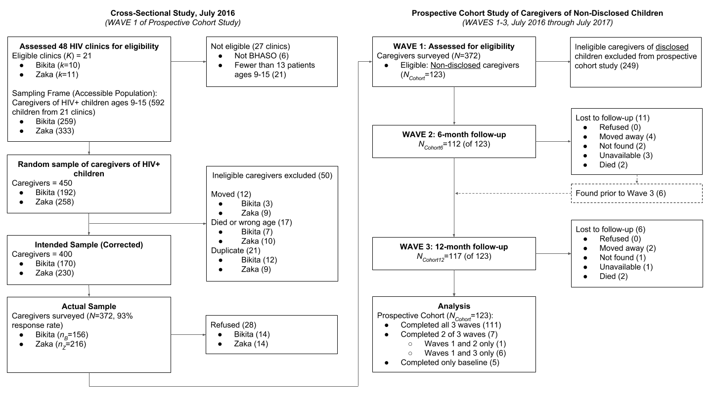

This study had two specific aims: 

**Aim 1.** Investigate the process of HIV disclosure and the barriers and facilitators of caregivers’ readiness to disclose through qualitative inquiry with adult caregivers of HIV-positive children, adult caregivers and adolescents living with HIV, and primary care clinic staff. 

**Aim 2.** Develop an instrument to assess a caregiver’s readiness and self-efficacy to disclose that can be used by trained lay and professional health workers in primary care settings to inform their use of HIV disclosure interventions.

Working in Zimbabwe’s Masvingo Province, we conducted formative qualitative research to understand the factors underlying caregivers’ readiness and self-efficacy to disclose, how and why this changes over time, how child characteristics including developmental level and health status impact a caregiver’s approach to disclosure, the positive and negative consequences of disclosing experienced by caregivers and children, and the types of support that caregivers and their families are seeking during the process of disclosure and beyond.

We used the qualitative findings to develop a broad survey instrument to assess a caregiver’s readiness and self-efficacy to disclose and potential barriers and facilitators to disclosure, such as their perceptions of the child’s readiness, the health status of the child or of themselves, fear of stigma, or qualities of the caregiver-child relationship. We recruited a cross-sectional sample of caregivers of HIV-positive children, administered the survey, and followed the cohort of non-disclosed caregivers for 12-months. We used the results to develop a measure of caregiver readiness to disclose.

The study protocol was approved by the Duke University Institutional Review Board, the Joint Parirenyatwa Hospital and College of Health Sciences Research Committee, the Medical Research Council of Zimbabwe, and the George Mason University Institutional Review Board. All study participants provided written informed consent.

# Aim 1: Formative Qualitative Study

Insert

# Aim 2: Measure Development

## Research Design

We recruited a population-based sample of caregivers of HIV-positive children ages 9 to 15 years to estimate the prevalence of pediatric HIV disclosure. After this baseline wave of data collection, we followed a prospective cohort of caregivers from the sample whose children were unaware of their HIV-positive status to understand the process of disclosure.

## Setting and Participants

The target population for this study was primary caregivers—parents and guardians— of HIV-positive children ages 9 to 15 living in rural Zimbabwe. The accessible population was limited to the subset of these caregivers living in Bikita and Zaka districts in Masvingo Province whose HIV-positive children were receiving antiretroviral therapy (or were in pre-ART). We selected this location because study partner BHASO (Batanai HIV and AIDS Service Organisation) had established relationships with 42 of the 48 HIV care clinics in these districts and supported a wide network of community health workers called CHASAs (Community HIV & AIDS Support Agents) deemed essential for participant recruitment and retention.

Masvingo Province is home to approximately 1.5 million people, 23% of whom live in Bikita and Zaka districts [10]. The demographics of Masvingo are similar to the rural clusters in the 2015 Zimbabwe Demographic and Health Survey (DHS) [11], suggesting that the accessible population from which we sampled may be representative of the target population of rural caregivers.

Zimbabwe continues to experience a generalized HIV/AIDS epidemic with an HIV prevalence rate of 13.5% among adults of reproductive age in 2016 (down from a peak of 27.7% in 1997); the adult HIV prevalence rate in Masvingo is estimated to be slightly lower at 12.9% [11]. In 2015, the prevalence of HIV among children aged 0 to 14 years was 1.8% nationally and 1.5% in Masvingo [11].

## Procedures

### Cross-Sectional Study of Pediatric HIV Disclosure Prevalence

At the time of this study, it was estimated that nearly 9 out of 10 HIV-positive children in Masvingo were enrolled in ART [12]. This made clinic-based recruitment a valid strategy for obtaining a representative sample of caregivers of HIV-positive children.

We constructed a sampling frame of pediatric HIV patients receiving ART or pre-ART services at 42 of the 48 HIV care clinics in Bikita and Zaka Districts; the 6 excluded facilities were not part of the BHASO network. Once we had an initial list of patient load by clinic, we excluded an additional 21 facilities that provided HIV care to fewer than 13 patients ages 9 to 15 (see Appendix A for an analysis of these exclusions). From the remaining 21 clinics, we used ART and pre-ART registers to develop a sampling frame of 592 eligible children (259 in Bikita and 333 in Zaka). We then used stratified simple random sampling by district (proportional to district size) to select a random sample of 450 children; the target sample size was driven by the needs of a larger study on disclosure readiness. We worked with CHASAs assigned to each clinic to update this sample through the removal of children no longer living in the district, children who had died, and duplicate records. After these corrections, the intended sample consisted of 400 children (under the care of 400 primary caregivers). See the participant flow diagram for additional details.

```{r flow, echo=FALSE, fig.cap="Participant flow diagram."}
  
```

Between June and August 2016, our team of Zimbabwean enumerators attempted to enroll and survey caregivers in the intended sample. Trained enumerators were assisted by local CHASAs throughout the recruitment process. Overall, the team surveyed 372 of 400 caregivers, a response rate of 93.0%. All surveys were conducted individually in a private setting at the HIV clinics where caregivers pick up medications for their children. Enumerators read each survey item aloud in Shona and recorded participants’ responses on an Android tablet running ODK Collect software [13].

### Prospective Cohort Study of the Disclosure Process

Using data from the first wave of data collection, we identified a cohort of 123 caregivers who said their HIV-positive child did not know his or her HIV status, and we followed this “non-disclosed” cohort through two additional waves of data collection over the next 12 months. We used the procedures described above and attempted to survey all 123 caregivers in this cohort at 6-months and 12-months following the first wave of data collection.

## Measures

### Caregiver and Child Demographics

We used relevant modules from the 2015 Zimbabwe DHS questionnaire (Phase 7) to collect demographic data on participants, their children, and their households [11].

### Caregiver-Reported Pediatric HIV Disclosure

We asked a series of questions to assess what the caregiver believes the child knows about his or her HIV status and condition, when the child learned this information, and from whom. We also asked whether the caregiver wanted the child to learn this information when they did. Specifically, we probed whether the child knows: (a) that he or she has a chronic condition requiring medication; (b) that he or she has a medical condition called HIV; (c) how he or she was infected with HIV; and (d) that he or she can spread the virus to others. “Partial disclosure” in this study refers to knowing (b), (c), or (d), but not all three. “Full disclosure” refers to knowing (b), (c), and (d) [15, 16, 17]. We use the term “disclosed” throughout to refer to children who know they have a virus called HIV to be consistent with other studies of pediatric HIV disclosure, but we also report results for partial and full disclosure.

For caregivers of disclosed children, we asked whether they found out their child’s HIV status before the child, on the same day as the child (e.g., in cases of disclosure by clinic staff), or after the child. This is an important distinction because we were interested in assessing caregivers’ preparation for disclosure, and caregivers who found out after or on the same day as the child had no time to prepare for disclosure.

For caregivers of non-disclosed children at Wave 1, we asked about their intentions to disclose their child’s HIV status within the next 12 months. We also asked these caregivers (yes or no) whether they had begun to assess their child’s readiness for disclosure, taken any steps to prepare their child, consulted with a health care worker about disclosure, or made a plan to disclose.

During first two survey waves, we realized that caregivers were keen to tell their story outside the confines of the questionnaire. In the final wave of the prospective cohort, we trained the enumerators in active listening and encouraged them to take notes about caregivers’ stories shared throughout the survey. At the end of each day, a trained qualitative interviewer collected these stories from the enumerators.

### Caregiver-Reported Worries about Disclosure

We created a series of 15 items to assess caregivers’ worries about disclosing the child’s status to the child. For instance, “I worry that telling [him/her] will make [him/her] too sad.” Caregivers responded to each item on a 4-point scale from (0) ‘not at all worried’, (1) ‘not very worried’, (2) ‘somewhat worried’, or (3) ‘very worried’.